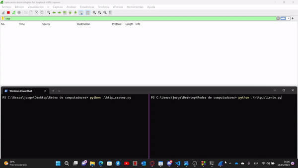
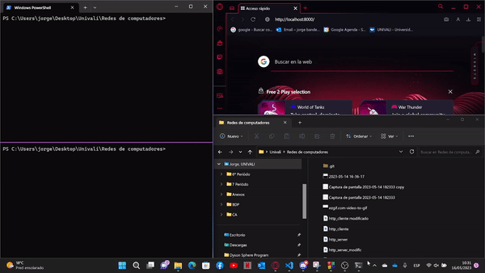

# Materia-RedCop
instruções específicas:
1) Implemente um serviço HTTP (servidor e cliente) através da biblioteca http.server para python,conforme exemplo dado na aula do dia 02.05.2023 (disponível no material da disciplina).

    - Inicie a coleta e análise dos pacotes através do WireShark, para o segmento de rede local.

    - Execute novamente o código exemplificado (servidor e cliente), no número de vezes que achar adequado.

    
    

    
   - Finalize a coleta de pacotes do WireShark.A partir disso, forneça os detalhes do socket criado nesta comunicação na forma de uma tupla:
            
            -Socket(source IP, destination IP, source port, destination port, service).
            
            -Socket(source IP: 127.0.0.1, destination IP: 127.0.0.1, source port: 8000, destination port: 65401, service: HTTP)
   L  embre-se de anexar as evidências e relatar adequadamente o processo de análise.

2) Adapte o mesmo código de modo que agora a resposta para o método HTTP GET direcione a umasaída HTML listando os arquivos que estão no diretório raíz do servidor (“/”). Como sugestão, vocêpode utilizar a biblioteca os do python para construir a lista e gerar a saída no formato HTML.

    a) Demonstre a construção do código para este exercício.

    b) Demonstre a saída, tanto a partir do browser quanto a partir de um client HTTP escrito porvocê.

    
    

    c) Comente, em um parágrafo, os aspectos de segurança em aplicações HTTP e possíveisimplicações a partir do código desenvolvido nesta questão.
    
      - O HTTP é um protocolo que envia informações em texto simples, o que significa que qualquer pessoa que interceptar o tráfego de rede pode ver as     informações sendo transmitidas. Além disso, o HTTP não possui nenhum mecanismo de autenticação ou criptografia, o que torna fácil para hackers     interceptar e manipular os dados enviados através do protocolo. Para tornar as aplicações HTTP mais seguras, é importante usar técnicas como       criptografia, autenticação, validação de entrada de usuário e proteção contra ataques de injeção de código. No caso específico deste código, uma   possível implicação de segurança é que qualquer pessoa que tenha acesso à rede local pode fazer uma solicitação HTTP para o servidor e ver a lista de arquivos no diretório raiz. Se houver arquivos sensíveis nesse diretório, eles podem ser expostos a pessoas não autorizadas.
3) O diagrama abaixo, explorado na aula do dia 18.04.2023, traz as funções ou métodos necessáriospara o estabelecimento de conexões via sockets utilizando como protocolo de transporte o TCP –tal como é o caso do protocolo de aplicação HTTP.Com base nisto, identifique o trecho de código desenvolvido nas questões anteriores que implementeou corresponda a cada uma dessas funções.

    
    
