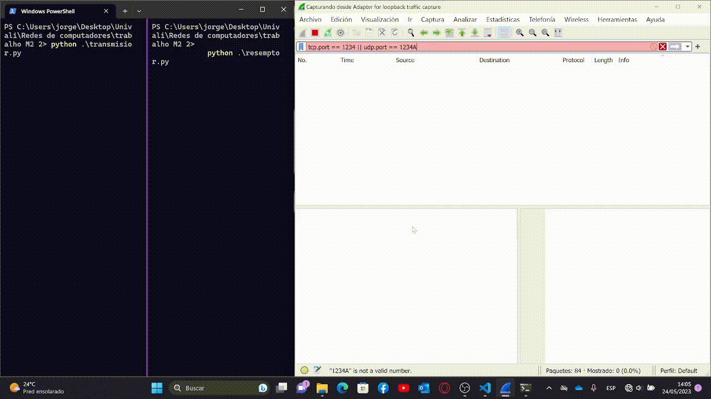

# Trabalho de Web Server M2.2
instruções específicas:
1) Implemente o código de um transmissor e de um receptor do protocolo UDP. Em python, poderá ser utilizada a biblioteca “socket”, com as instruções disponíveis em https://wiki.python.org/moin/UdpCommunication.

    - Inicie a coleta e análise dos pacotes através do WireShark, para o segmento de rede local.
    - Execute o código desenvolvido (transmissor e receptor), no número de vezes que achar adequado.
    - Finalize a coleta de pacotes do WireShark.
    
    a) Forneça evidências da implementação do código e do seu funcionamento.
    b) Forneça o diagrama de sequências de toda a comunicação.
    c) Escolha um dos pacotes recebidos (isto é, do receptor), e transcreva o seu datagrama.
    
  
2) Como se dá o cálculo do checksum em pacotes UDP? Exemplifique.
3) O protocolo IP (camada de rede) fornece comunicação fim-a-fim, mas os pacotes podem ser 
perdidos, duplicados e desordenados. O UDP, que utiliza os serviços do protocolo IP, também 
fornece um serviço com as mesmas características. Sendo assim, qual a vantagem de um 
desenvolvedor utilizar o protocolo UDP e não o protocolo IP diretamente, já que teria menos 
overhead?
4) Explique qual a relação existente entre o tamanho de um datagrama UDP, o processo de 
fragmentação IP, e a probabilidade do datagrama UDP ser perdido ou descartado

# Desenbolvimento
## Questão 1
- Código do reseptor
                        
        import socket

        # Endereço IP e porta do servidor
        server_ip = 'localhost'
        server_port = 1234

        # Cria o socket do servidor
        server_socket = socket.socket(socket.AF_INET, socket.SOCK_DGRAM)
        server_socket.bind((server_ip, server_port))

        print('Servidor aguardando conexões...')

        # Recebe e exibe as mensagens recebidas do cliente
        while True:
            data, address = server_socket.recvfrom(1024)
            print('Mensagem recebida do cliente:', data.decode())

            # Envia uma resposta para o cliente
            response = 'Mensagem recebida com sucesso!'
            server_socket.sendto(response.encode(), address)
- Código do transmisor

        import socket

        # Endereço IP e porta do servidor
        server_ip = 'localhost'
        server_port = 1234

        # Cria o socket do cliente
        client_socket = socket.socket(socket.AF_INET, socket.SOCK_DGRAM)

        # Envia mensagens para o servidor
        while True:
            message = input('Digite a mensagem para enviar ao servidor (ou "sair" para encerrar): ')

            if message.lower() == 'sair':
                break

            client_socket.sendto(message.encode(), (server_ip, server_port))

            # Recebe a resposta do servidor
            response, address = client_socket.recvfrom(1024)
            print('Resposta do servidor:', response.decode())

        # Fecha o socket do cliente
        client_socket.close()
    a) implementação e comprovação do código  
     

    
    

    b) diagrama da comunicação com os blocos de açoes de cada elemento
    

    
    

    c)
    Ao realizarmos o salvamento dos dados da captura de pacotes optivemos esta mesnagem de texto no formato txt 
    
        No.     Time           Source                Destination           Protocol Length Info
             88 88.481668      127.0.0.1             127.0.0.1             UDP      44     57192 → 1234 Len=12

        Frame 88: 44 bytes on wire (352 bits), 44 bytes captured (352 bits) on interface \Device\NPF_Loopback, id 0
        Null/Loopback
        Internet Protocol Version 4, Src: 127.0.0.1, Dst: 127.0.0.1
        User Datagram Protocol, Src Port: 57192, Dst Port: 1234
        Data (12 bytes)

        0000  6a 6f 72 67 65 20 62 61 6e 64 65 6f               jorge bandeo
            Data: 6a6f7267652062616e64656f
            [Length: 12]

        No.     Time           Source                Destination           Protocol Length Info
             89 88.481943      127.0.0.1             127.0.0.1             UDP      62     1234 → 57192 Len=30

        Frame 89: 62 bytes on wire (496 bits), 62 bytes captured (496 bits) on interface \Device\NPF_Loopback, id 0
        Null/Loopback
        Internet Protocol Version 4, Src: 127.0.0.1, Dst: 127.0.0.1
        User Datagram Protocol, Src Port: 1234, Dst Port: 57192
        Data (30 bytes)

        0000  4d 65 6e 73 61 67 65 6d 20 72 65 63 65 62 69 64   Mensagem recebid
        0010  61 20 63 6f 6d 20 73 75 63 65 73 73 6f 21         a com sucesso!
            Data: 4d656e736167656d20726563656269646120636f6d207375636573736f21
            [Length: 30]
    - Realizando a leitura e comprenção ralizamos a transcrição dos dados acima 
    
        - Pacote 1:

                Endereço IP de origem: 127.0.0.1
                Endereço IP de destino: 127.0.0.1
                Protocolo: User Datagram Protocol (UDP)
                Porta de origem: 57192
                Porta de destino: 1234
                Dados: 6a6f7267652062616e64656f (hexadecimal) ou "jorge bandeo" (em ASCII)
                Comprimento dos dados: 12 bytes
            
        - Pacote 2:

                Endereço IP de origem: 127.0.0.1
                Endereço IP de destino: 127.0.0.1
                Protocolo: User Datagram Protocol (UDP)
                Porta de origem: 1234
                Porta de destino: 57192
                Dados: 4d656e736167656d20726563656269646120636f6d207375636573736f21 (hexadecimal) ou "Mensagem recebida com sucesso!" (em ASCII)
                Comprimento dos dados: 30 bytes

    
## Questão 2
O cálculo do checksum em pacotes UDP é feito somando-se todos os dados do pacote, incluindo o cabeçalho UDP, e adicionando um campo de checksum no cabeçalho. O checksum é calculado através de um algoritmo de soma de verificação. O destinatário do pacote realiza o mesmo cálculo e verifica se o checksum recebido é igual ao calculado. Se forem diferentes, o pacote é considerado corrompido.
## Questão 3
O protocolo IP fornece comunicação fim-a-fim, mas não garante a entrega confiável dos pacotes, ou seja, pacotes podem ser perdidos, duplicados ou chegar fora de ordem. O protocolo UDP, que utiliza os serviços do protocolo IP, também possui as mesmas características. No entanto, o UDP é mais leve em termos de overhead, pois não possui mecanismos de controle de fluxo, retransmissão de pacotes perdidos e controle de congestionamento, como é o caso do TCP. Isso faz do UDP uma escolha adequada em situações onde a entrega rápida é mais importante do que a garantia de entrega confiável.
## Questão 4
O tamanho de um datagrama UDP está limitado ao tamanho máximo permitido pelo protocolo IP. Se um datagrama UDP exceder esse tamanho, o IP realizará o processo de fragmentação, dividindo o datagrama em fragmentos menores que se encaixem no tamanho permitido. No entanto, a fragmentação IP aumenta a probabilidade de perda ou descarte dos pacotes, uma vez que cada fragmento é tratado como uma unidade separada pelos roteadores e pode ser perdido independentemente dos outros fragmentos. Portanto, um datagrama UDP maior tem uma probabilidade maior de ser perdido ou descartado durante a transmissão. Para minimizar a fragmentação e a probabilidade de perda, é recomendável que o tamanho dos datagramas UDP seja menor que o tamanho máximo permitido pelo protocolo IP.
